# Home Trainer

  - Home Trainer is a mobile application (currently available only for android) where you can build well-structured sports programs. 
  - The main idea is that based on selected activities you can build complex and customized sports programs that you can add to your weekly schedule.
  - Each category of sport has different characteristics, for example, "GYM" will have characteristics such as muscle group, exercise, sets, repetitions, etc; and activity as "RUNNING" will have characteristics such as distance, intensity, break time, etc.
  - After building a sports program, you are now able to schedule it for your weekly routines.
  - You can also benefit from other services such as a stopwatch, timer, or most importantly a graph that analyzes and displays the evolution of the user's physical condition.
  - The app is still in development, so more features are coming soon.

# Contents

- [Authentication](#authentication)
- [Profile page](#profile-page)
- [Routine page](#routine-page)
- [Scheduled page](#scheduled-page)
- [Analytics page](#analytics-page)

### Authentication
 - The login page is the first page you will encounter, you can authenticate with email and password if you have already created an account or you can authenticate using Google or Facebook
 - If you decide to create an account using email and password, you'll be redirected to another page with a small form to fill out. After the registration is completed a confirmation email will be sent to verify the user email.
 - After you logged in for the first time, you'll have to complete the last and more fun form about your physical condition, this form is required for the computer to start calculating the progress of your physical condition.
 - And you are done, you can now navigate between the screens, create your own sport routine and schedule them for your weekly routine programs.

 

    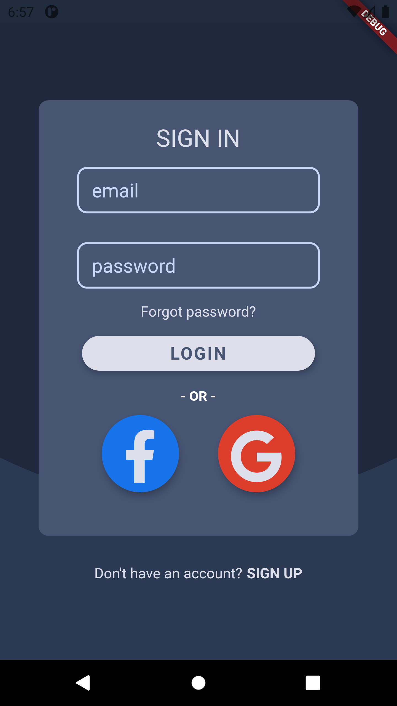
    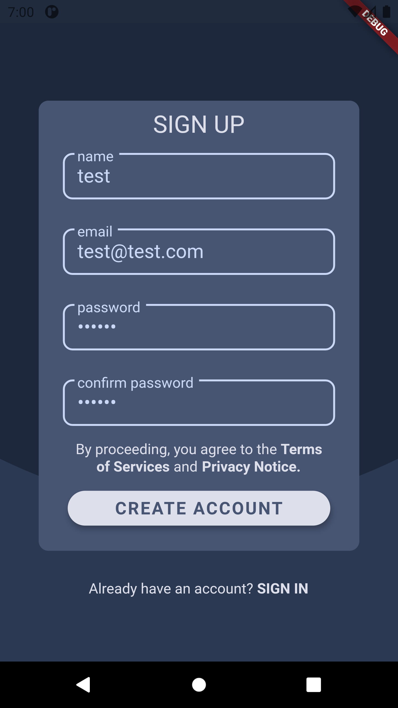
    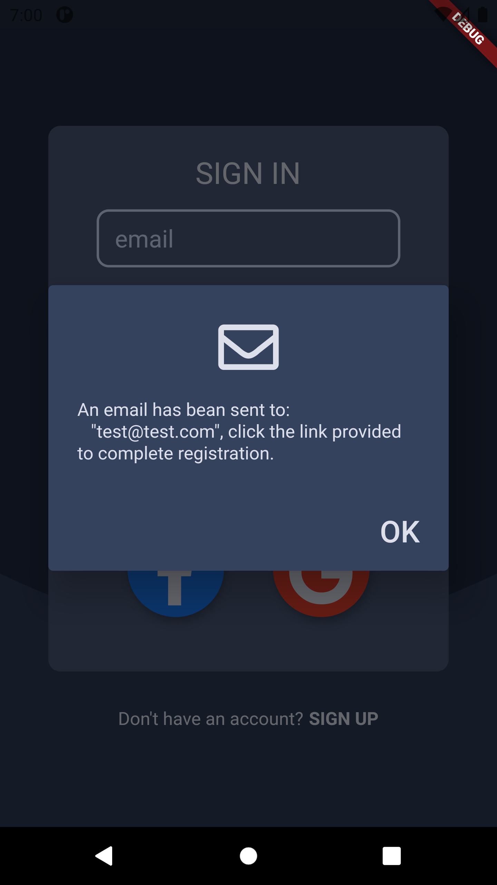
    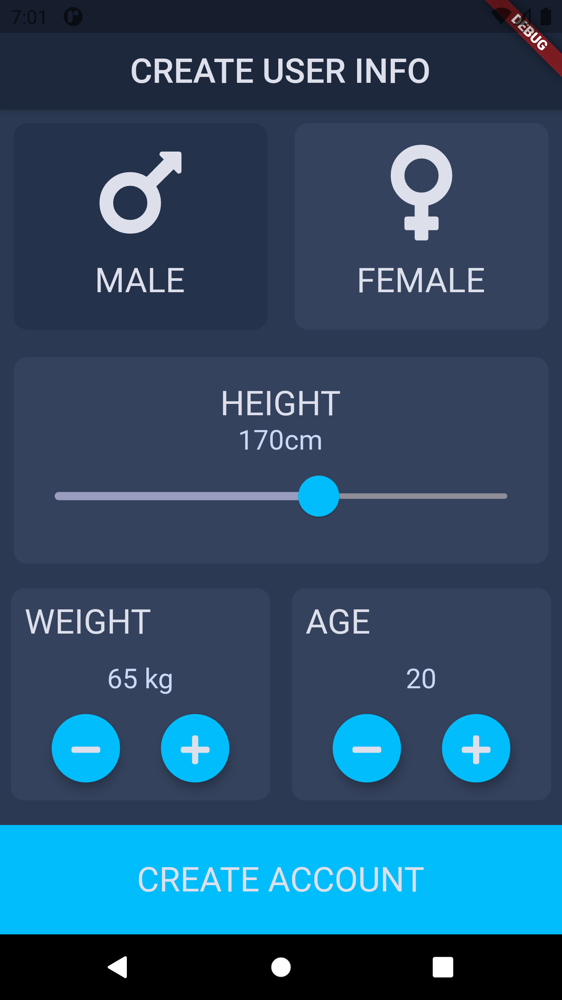

### Profile page
 - After the registration, the profile page is the second page that you will encounter, here you'll find a little information about your profile.
 - Here you can also find a photo, which currently is only a default photo, but soon enough you'll be able to upload your photos.
 - The profile page is also the only page with a drawer where you can benefit of a timer and a stopwatch, here you'll also find the sign out button, but most importantlly, the button that will take you to the "update user info" where you update your physicla confition to keep track of your evolution.

 

    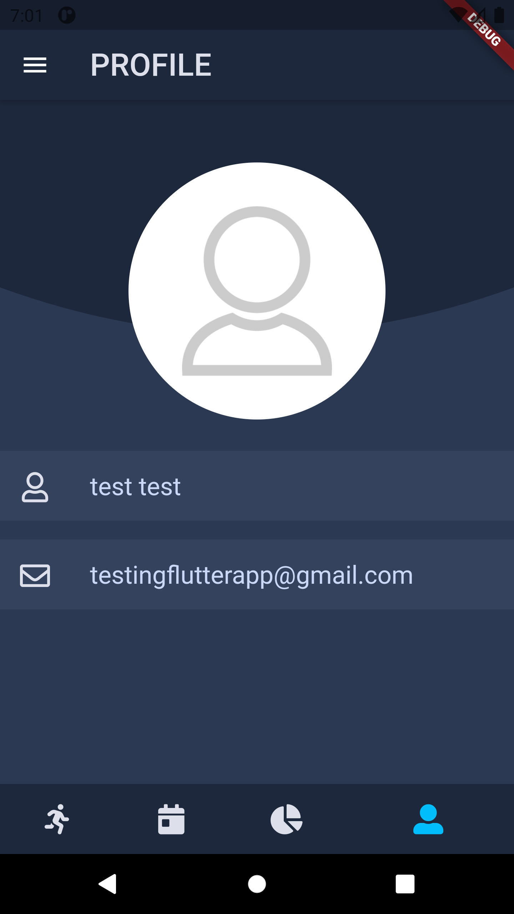
    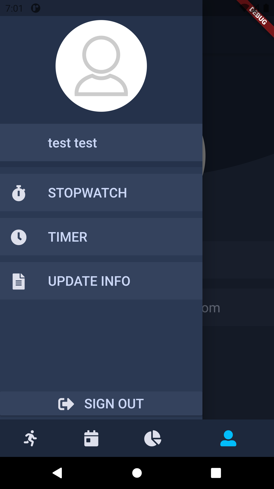
    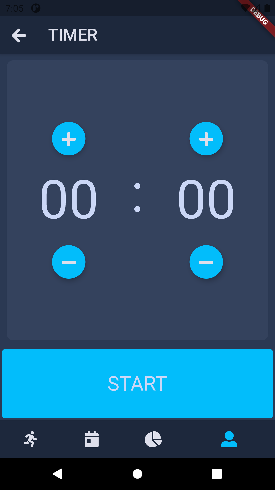
    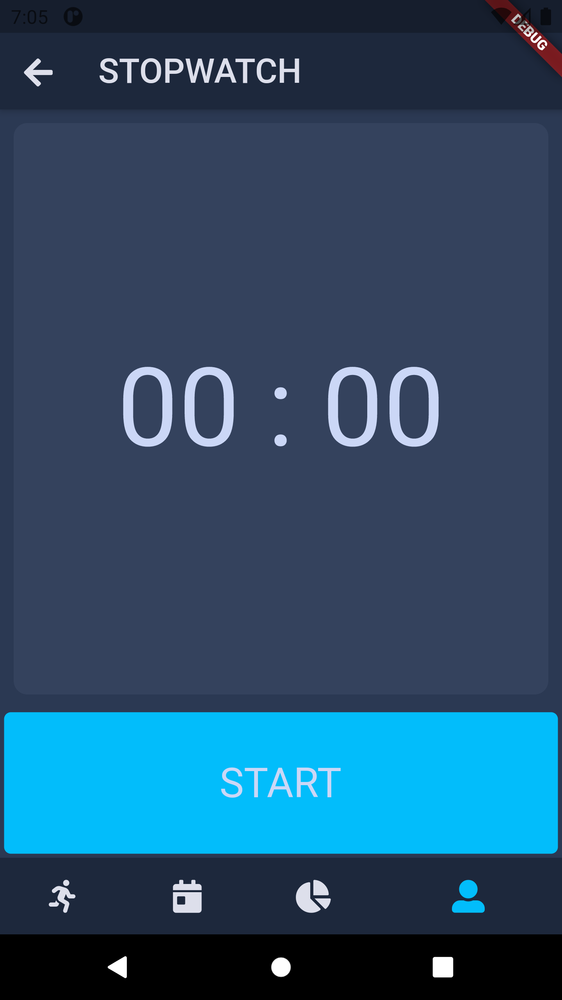

### Routine page
 - In this page you will create your own sports routines based on your preferences, click the "add" button to choose a sport type and create your own, completely customizable sport routine.
 - Although right now you'll be able to choose only between four types of sports, those sports cover almost all types of sports. More option will be implemented later.

 

    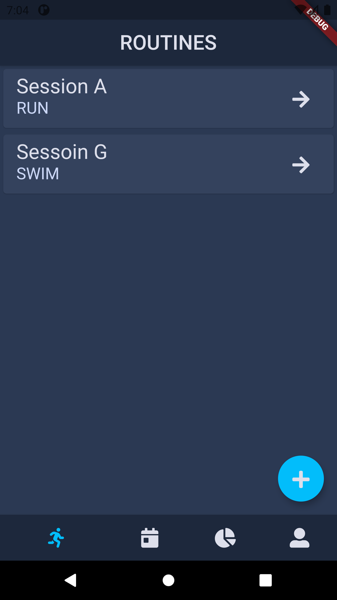
    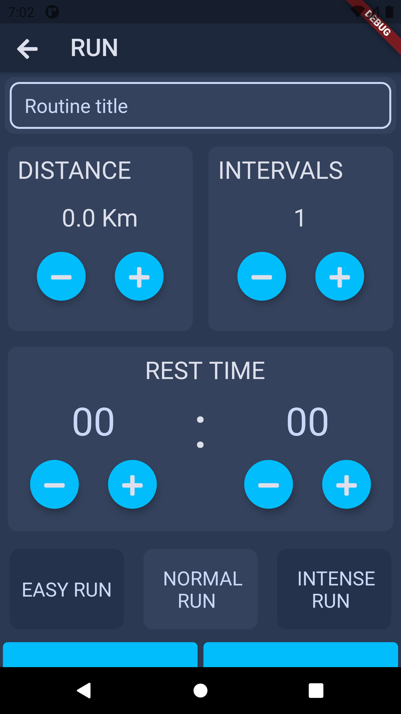
    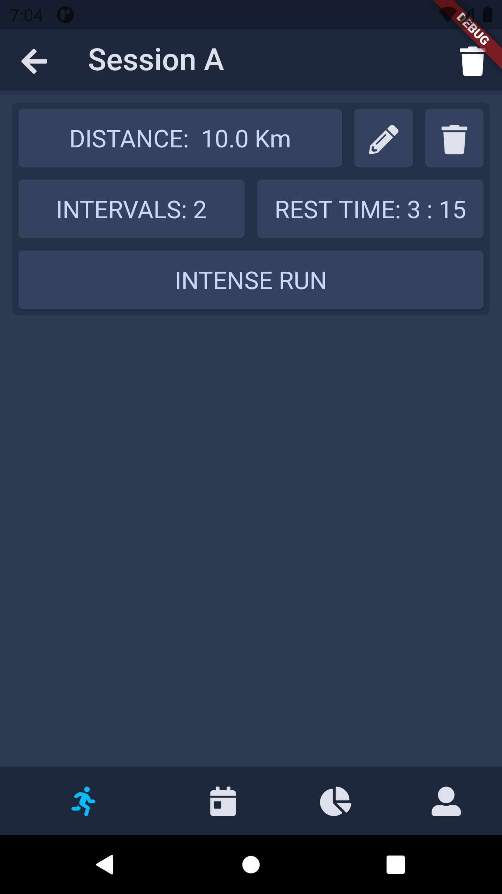

### Scheduled page
 - This is the page you'll be spanding most of the time, here you'll find a list of weekdays where you can shcedule a routine you have made only for that specific day.
 - After opening a weekday, click on the "add" button to open a list of all the routines you've made and select every routine you want to be added to that day. 
 - Now the real fun begins, you can see the routines you scheduled for that specific day, so you can start to actually doing sport.

 

    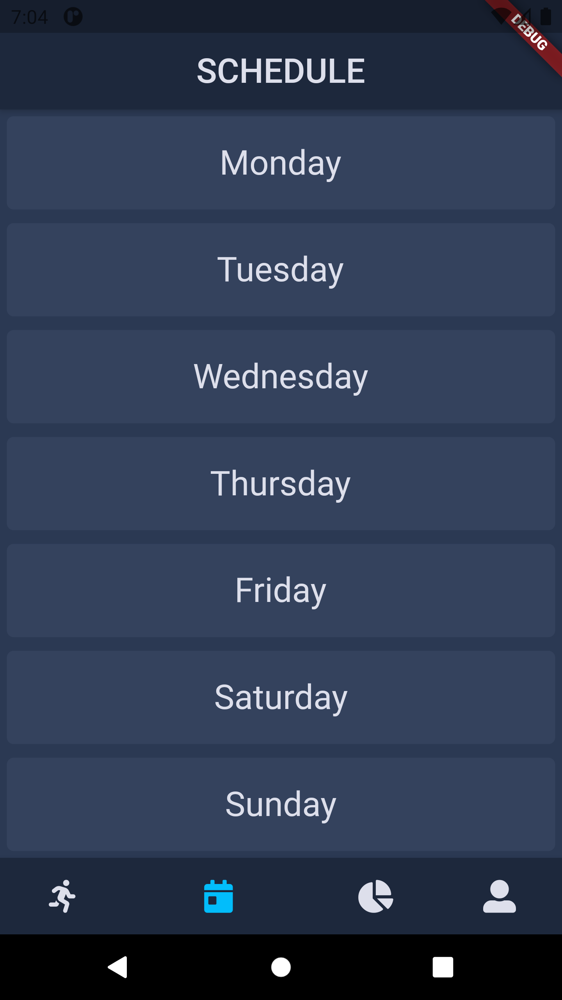
    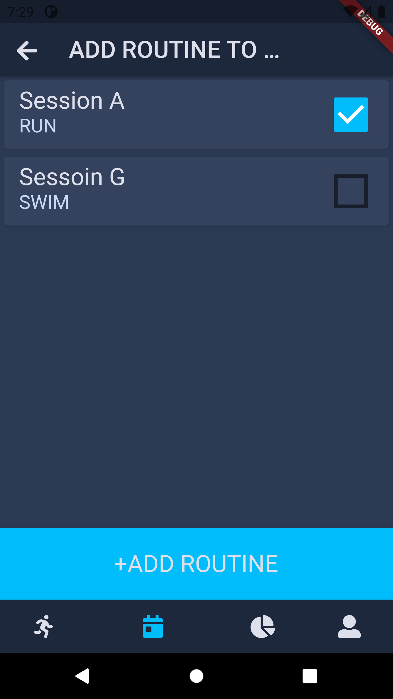
    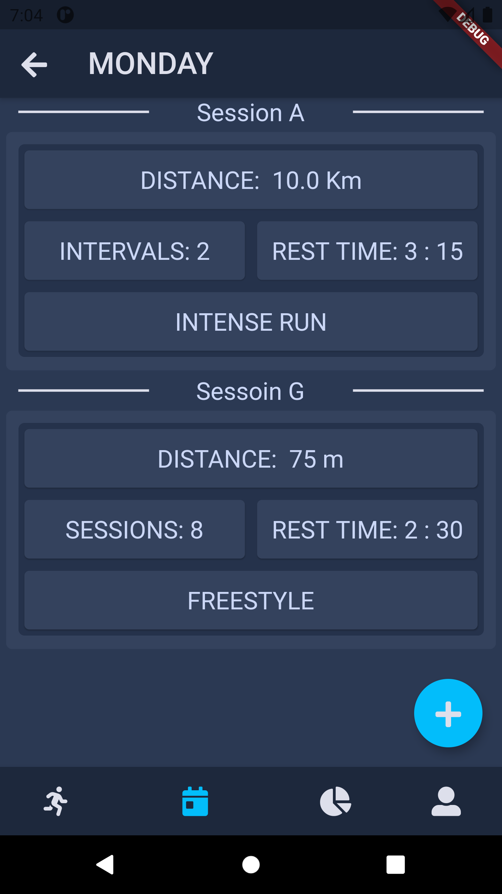

### Analytics page
 - In this page you'll find a graphic that indicate your physical condition evolution, to update you data go to profile page, open the drawer and go to "update user info" section to update you data.
 - If you updated your physical condition data press the refresh button on the top right screen to see your new poit on the graphic.

 

    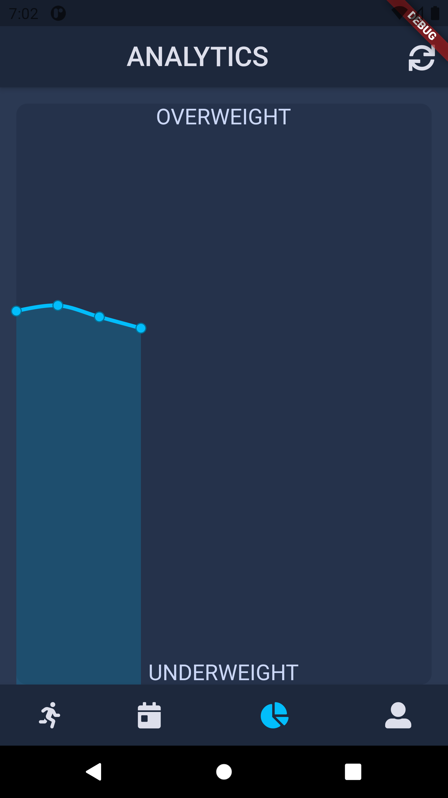

